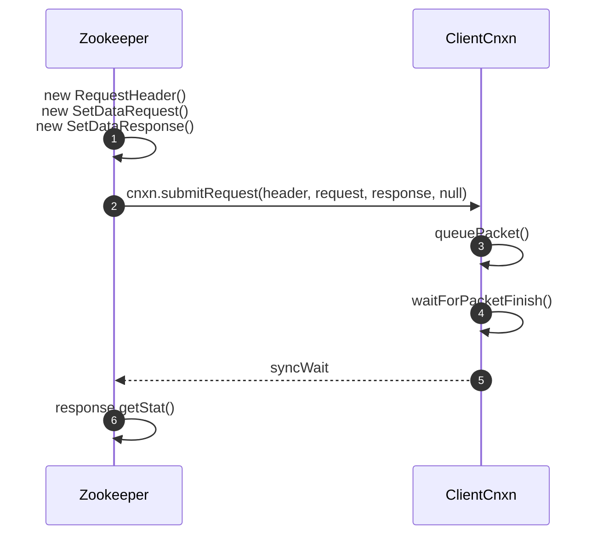
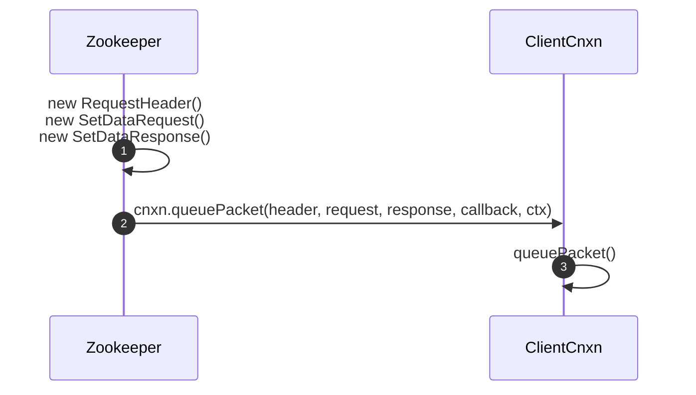
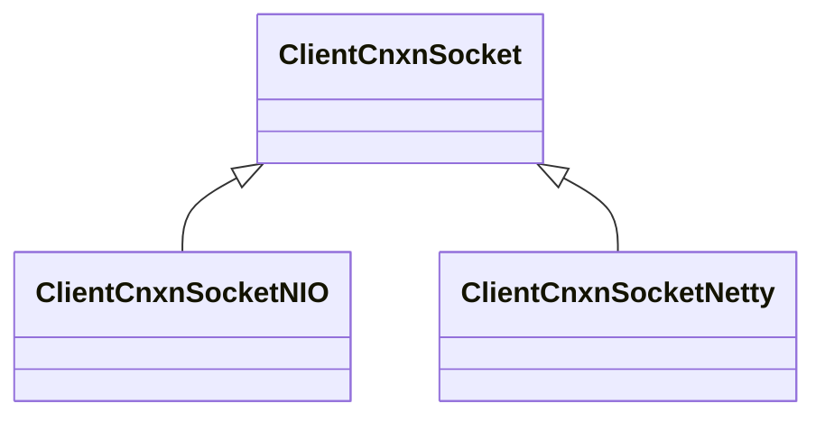
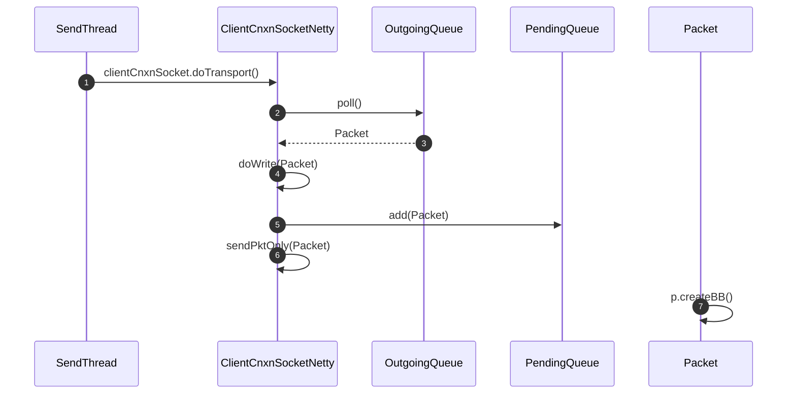
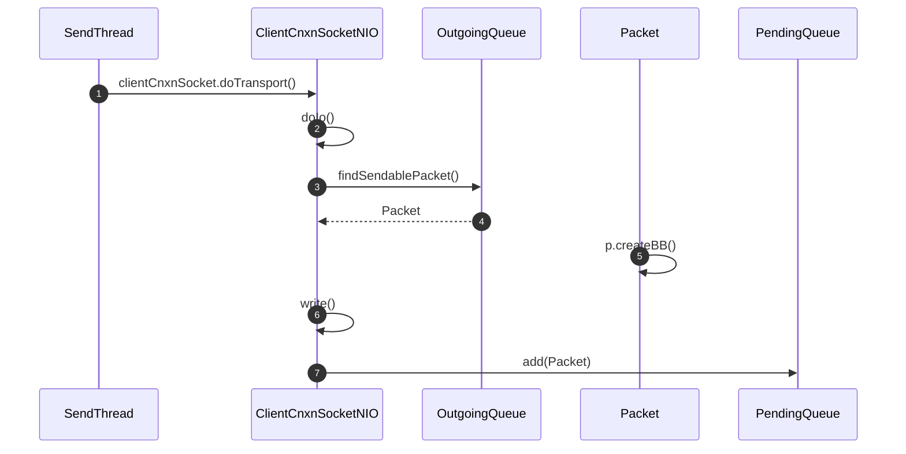
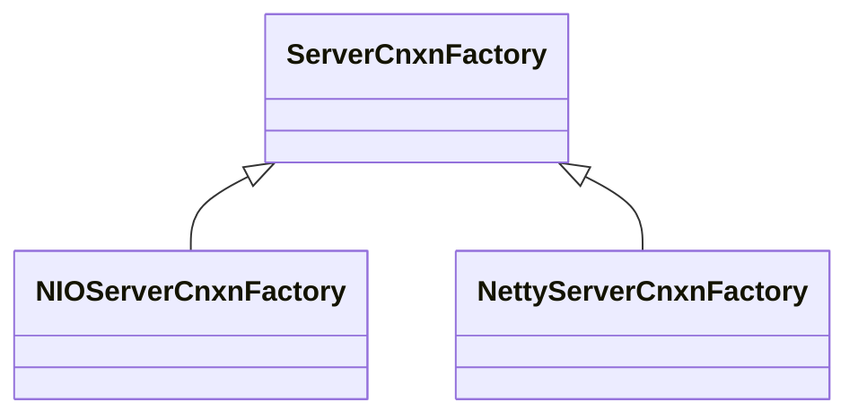
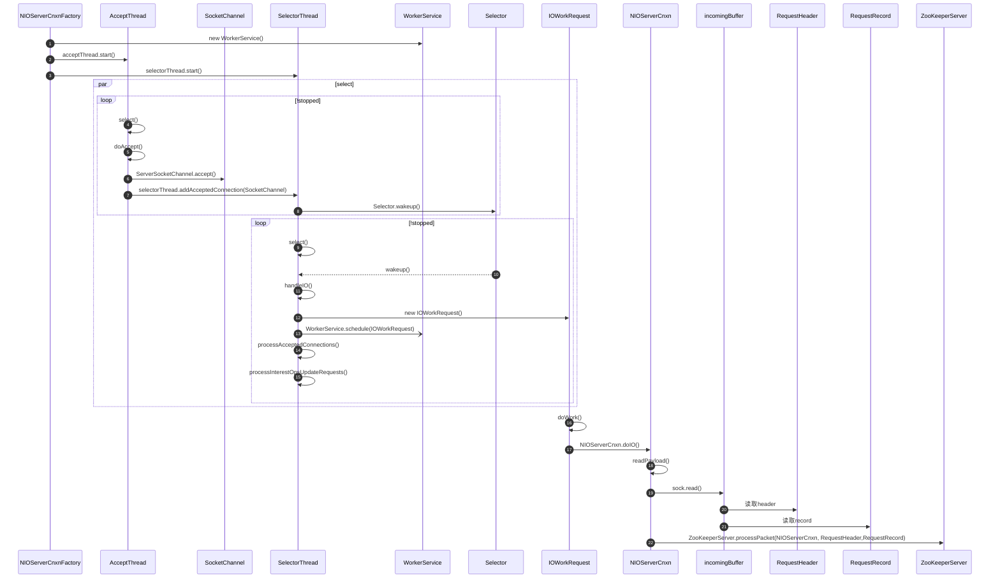
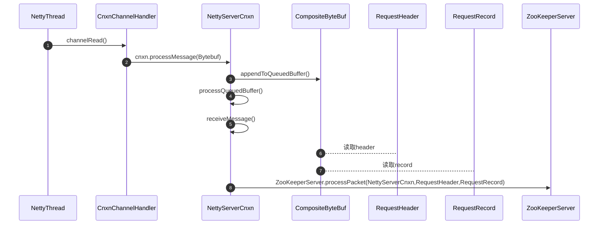
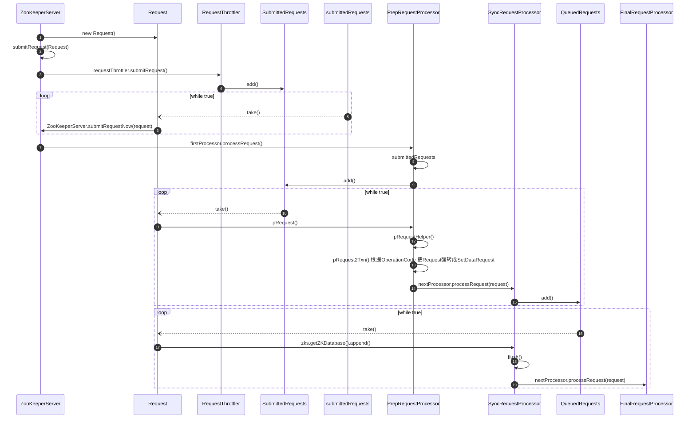

# SetData

## Client 端发起请求

### 构建`SetDataRequest` 和 `SetDataResponse`  

参数

- path
- data
- version

```java
    final String clientPath = path;
    PathUtils.validatePath(clientPath);

    final String serverPath = prependChroot(clientPath);

    RequestHeader h = new RequestHeader();
    h.setType(ZooDefs.OpCode.setData);
    SetDataRequest request = new SetDataRequest();
    request.setPath(serverPath);
    request.setData(data);
    request.setVersion(version);
    SetDataResponse response = new SetDataResponse();
```

### 发送请求

同步发送  `org.apache.zookeeper.ZooKeeper#setData(java.lang.String, byte[], int)`  

1. 提交请求
2. 同步等待
3. 返回结果

```java
ReplyHeader r = cnxn.submitRequest(h, request, response, null);
if (r.getErr() != 0) {
    throw KeeperException.create(KeeperException.Code.get(r.getErr()), clientPath);
}
return response.getStat();
```



异步发送  `org.apache.zookeeper.ZooKeeper#setData(java.lang.String, byte[], int, org.apache.zookeeper.AsyncCallback.StatCallback, java.lang.Object)`  

```java
cnxn.queuePacket(h, new ReplyHeader(), request, response, cb, clientPath, serverPath, ctx, null);
```



### `queuePacket()` Packet入队

1. Packet packet = new Packet();
2. outgoingQueue.add(packet);

   ```java
   private final LinkedBlockingDeque<Packet> outgoingQueue = new LinkedBlockingDeque<>();
   // 负责存储 待发送的数据包
   ```

3. sendThread.getClientCnxnSocket().packetAdded(); 通知Socket, Packet已经入队  

   ```java
   @Override
   public void run() {
       clientCnxnSocket.introduce(this, sessionId, outgoingQueue);
   }
   ```

   SendThread运行时，初始化`outgoingQueue`到`ClientCnxnSocket`中

#### `ClientCnxnSocket`



通过配置`zookeeper.clientCnxnSocket`确定使用**Netty**还是**Java NIO**

```java
private ClientCnxnSocket getClientCnxnSocket() throws IOException {
    String clientCnxnSocketName = getClientConfig().getProperty(ZKClientConfig.ZOOKEEPER_CLIENT_CNXN_SOCKET);
    if (clientCnxnSocketName == null || clientCnxnSocketName.equals(ClientCnxnSocketNIO.class.getSimpleName())) {
        clientCnxnSocketName = ClientCnxnSocketNIO.class.getName();
    } else if (clientCnxnSocketName.equals(ClientCnxnSocketNetty.class.getSimpleName())) {
        clientCnxnSocketName = ClientCnxnSocketNetty.class.getName();
    }

    try {
        Constructor<?> clientCxnConstructor = Class.forName(clientCnxnSocketName)
                                                    .getDeclaredConstructor(ZKClientConfig.class);
        ClientCnxnSocket clientCxnSocket = (ClientCnxnSocket) clientCxnConstructor.newInstance(getClientConfig());
        return clientCxnSocket;
    } catch (Exception e) {
        throw new IOException("Couldn't instantiate " + clientCnxnSocketName, e);
    }
}
```

#### `doTransport()`

Do transportation work:

- read packets into incomingBuffer.
- write outgoing queue packets.
- update relevant timestamp.

从`outgoingQueue`中取出`Packet`发送，并添加到`pendingQueue`中

`org.apache.zookeeper.ClientCnxnSocketNetty#doTransport`



`org.apache.zookeeper.ClientCnxnSocketNIO#doTransport`



## Server 端处理请求

### `ServerCnxnFactory` 启动 Server

`org.apache.zookeeper.server.ServerCnxnFactory#startup(org.apache.zookeeper.server.ZooKeeperServer)`

```java
start();
setZooKeeperServer(zks);
if (startServer) {
    zks.startdata();
    zks.startup();
}
```

1. Socket端口监听
2. 设置ZookeeperSever引用
3. 启动存储
4. 启动内部组件

处理请求时最终会转发到下面两个方法:

- 处理请求`org.apache.zookeeper.server.ZooKeeperServer#processPacket`
- 处理连接`org.apache.zookeeper.server.ZooKeeperServer#processConnectRequest`

服务端两种实现**Netty**和**Java NIO**



#### Java NIO实现

`org.apache.zookeeper.server.NIOServerCnxnFactory.AcceptThread`
`org.apache.zookeeper.server.NIOServerCnxnFactory.SelectorThread`
`org.apache.zookeeper.server.WorkerService`
服务端处理请求过程



- 1 accept thread, which accepts new connections and assigns to a selector thread
- 1-N selector threads, each of which selects on 1/N of the connections.The reason the factory supports more than one selector thread is that with large numbers of connections, select() itself can become aperformance bottleneck.
- 0-M socket I/O worker threads, which perform basic socket reads and writes. If configured with 0 worker threads, the selector threads do the socket I/O directly.
- 1   connection expiration thread, which closes idle connections; this is necessary to expire connections on which no session is established.

#### Netty 实现

`org.apache.zookeeper.server.NettyServerCnxnFactory.CnxnChannelHandler`
服务端处理请求过程



总结一下两种实现
基于JavaNIO的实现比Netty复杂
Netty提供了便利的Reactor模型，而在JavaNIO中需要自己实现Reactor模型
整体思路是

1. accept()连接
2. 读取数据加入缓冲buffer，生成`RequestHeader`和`RequestRecord`
3. 最终由ZooKeeperServer.processPacket()处理请求

### `org.apache.zookeeper.server.ZooKeeperServer#processPacket`

```java
Request si = new Request(cnxn, cnxn.getSessionId(), h.getXid(), h.getType(), request, cnxn.getAuthInfo());
int length = request.limit();
if (isLargeRequest(length)) {
    // checkRequestSize will throw IOException if request is rejected
    checkRequestSizeWhenMessageReceived(length);
    si.setLargeRequestSize(length);
}
si.setOwner(ServerCnxn.me);
submitRequest(si);
```



> RequestProcessor setup()
>
> ```java
> RequestProcessor finalProcessor = new FinalRequestProcessor(this);
> RequestProcessor syncProcessor = new SyncRequestProcessor(this, finalProcessor);
> ((SyncRequestProcessor) syncProcessor).start();
> firstProcessor = new PrepRequestProcessor(this, syncProcessor);
> ((PrepRequestProcessor) firstProcessor).start();
> ```
>
> 构建了如下执行链`PrepRequestProcessor -> SyncRequestProcessor -> FinalRequestProcessor`，链式调用
>
>```mermaid
>classDiagram
>    ZooKeeperCriticalThread <|-- RequestThrottler
>    ZooKeeperThread <|-- ZooKeeperCriticalThread
>    Thread <|-- ZooKeeperThread
>    ZooKeeperCriticalThread <|-- PrepRequestProcessor
>    RequestProcessor <|.. PrepRequestProcessor
>    ZooKeeperCriticalThread <|-- SyncRequestProcessor
>    RequestProcessor <|.. SyncRequestProcessor
>    RequestProcessor <|.. FinalRequestProcessor
>```

总结一下 处理请求的过程
`processPacket()`

1. 把`Request`提交到`RequestThrottler`, `RequestThrottler`作为线程异步轮询`take()`队列中的`Request`，提交给`RequestProcessor`处理
2. `ZookeeperServer`在创建时，构建了如下执行链`PrepRequestProcessor -> SyncRequestProcessor -> FinalRequestProcessor`
3. `PrepRequestProcessor`,`SyncRequestProcessor`提交`Request`的方式与`RequestThrottler`相同，都是先入队，异步轮询`take()`队列中的`Request`
4. `PrepRequestProcessor`负责记录`Data`的变化， `SyncRequestProcessor`负责刷新zookeeperDB，`FinalRequestProcessor` 负责向`RequestPathMetricsCollector`注册变化的`Path`
PrepRequestProcessor

```java
case OpCode.setData: {
    zks.sessionTracker.checkSession(request.sessionId, request.getOwner());
    SetDataRequest setDataRequest = (SetDataRequest) record;
    path = setDataRequest.getPath();
    validatePath(path, request.sessionId);
    nodeRecord = getRecordForPath(path);
    zks.checkACL(request.cnxn, nodeRecord.acl, ZooDefs.Perms.WRITE, request.authInfo, path, null);
    zks.checkQuota(path, nodeRecord.data, setDataRequest.getData(), OpCode.setData);
    int newVersion = checkAndIncVersion(nodeRecord.stat.getVersion(), setDataRequest.getVersion(), path);
    request.setTxn(new SetDataTxn(path, setDataRequest.getData(), newVersion));
    nodeRecord = nodeRecord.duplicate(request.getHdr().getZxid());
    nodeRecord.stat.setVersion(newVersion);
    nodeRecord.stat.setMtime(request.getHdr().getTime());
    nodeRecord.stat.setMzxid(zxid);
    nodeRecord.data = setDataRequest.getData();
    nodeRecord.precalculatedDigest = precalculateDigest(DigestOpCode.UPDATE, path, nodeRecord.data, nodeRecord.stat);
    setTxnDigest(request, nodeRecord.precalculatedDigest);
    addChangeRecord(nodeRecord);
    break;
}
```

SyncRequestProcessor

```java
zks.getZKDatabase().append(si)
....
toFlush.add(si);
if (shouldFlush()) {
    flush();
}
```

FinalRequestProcessor

```java
case OpCode.setData: {
    lastOp = "SETD";
    rsp = new SetDataResponse(rc.stat);
    err = Code.get(rc.err);
    requestPathMetricsCollector.registerRequest(request.type, rc.path);
    break;
}
```
