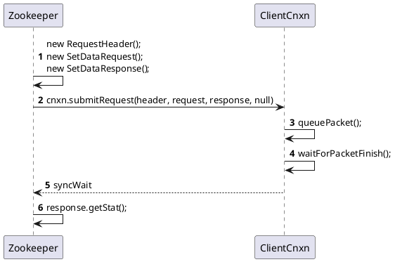
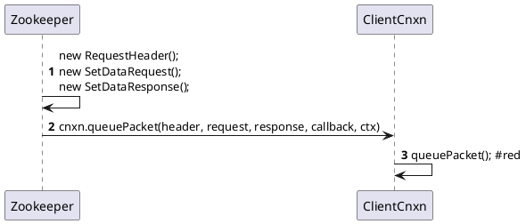
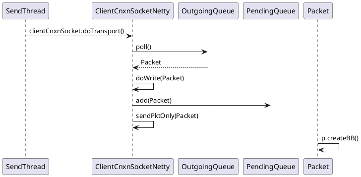
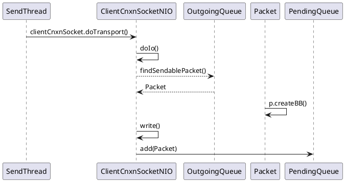

# SetData

## Client 端发起请求

### 构建`SetDataRequest` 和 `SetDataResponse`  

参数

- path
- data
- version

```java
    final String clientPath = path;
    PathUtils.validatePath(clientPath);

    final String serverPath = prependChroot(clientPath);

    RequestHeader h = new RequestHeader();
    h.setType(ZooDefs.OpCode.setData);
    SetDataRequest request = new SetDataRequest();
    request.setPath(serverPath);
    request.setData(data);
    request.setVersion(version);
    SetDataResponse response = new SetDataResponse();
```

### 发送请求

同步发送  `org.apache.zookeeper.ZooKeeper#setData(java.lang.String, byte[], int)`  

1. 提交请求
2. 同步等待
3. 返回结果

```java
ReplyHeader r = cnxn.submitRequest(h, request, response, null);
if (r.getErr() != 0) {
    throw KeeperException.create(KeeperException.Code.get(r.getErr()), clientPath);
}
return response.getStat();
```



异步发送  `org.apache.zookeeper.ZooKeeper#setData(java.lang.String, byte[], int, org.apache.zookeeper.AsyncCallback.StatCallback, java.lang.Object)`  

```java
cnxn.queuePacket(h, new ReplyHeader(), request, response, cb, clientPath, serverPath, ctx, null);
```



### `queuePacket()` Packet入队

1. Packet packet = new Packet();
2. outgoingQueue.add(packet);

   ```java
   private final LinkedBlockingDeque<Packet> outgoingQueue = new LinkedBlockingDeque<>();
   // 负责存储 待发送的数据包
   ```

3. sendThread.getClientCnxnSocket().packetAdded(); 通知Socket, Packet已经入队  

   ```java
   @Override
   public void run() {
       clientCnxnSocket.introduce(this, sessionId, outgoingQueue);
   }
   ```
   SendThread运行时，初始化`outgoingQueue`到`ClientCnxnSocket`中

#### `ClientCnxnSocket`

```plantuml
class ClientCnxnSocket
class ClientCnxnSocketNetty extends ClientCnxnSocket
class ClientCnxnSocketNIO extends ClientCnxnSocket
```

通过配置`zookeeper.clientCnxnSocket`确定使用**Netty**还是**Java NIO**

```java
private ClientCnxnSocket getClientCnxnSocket() throws IOException {
    String clientCnxnSocketName = getClientConfig().getProperty(ZKClientConfig.ZOOKEEPER_CLIENT_CNXN_SOCKET);
    if (clientCnxnSocketName == null || clientCnxnSocketName.equals(ClientCnxnSocketNIO.class.getSimpleName())) {
        clientCnxnSocketName = ClientCnxnSocketNIO.class.getName();
    } else if (clientCnxnSocketName.equals(ClientCnxnSocketNetty.class.getSimpleName())) {
        clientCnxnSocketName = ClientCnxnSocketNetty.class.getName();
    }

    try {
        Constructor<?> clientCxnConstructor = Class.forName(clientCnxnSocketName)
                                                    .getDeclaredConstructor(ZKClientConfig.class);
        ClientCnxnSocket clientCxnSocket = (ClientCnxnSocket) clientCxnConstructor.newInstance(getClientConfig());
        return clientCxnSocket;
    } catch (Exception e) {
        throw new IOException("Couldn't instantiate " + clientCnxnSocketName, e);
    }
}
```

#### `doTransport()`

Do transportation work:

- read packets into incomingBuffer.
- write outgoing queue packets.
- update relevant timestamp.

从`outgoingQueue`中取出`Packet`发送，并添加到`pendingQueue`中

`org.apache.zookeeper.ClientCnxnSocketNetty#doTransport`



`org.apache.zookeeper.ClientCnxnSocketNIO#doTransport`



## Server 端处理请求
