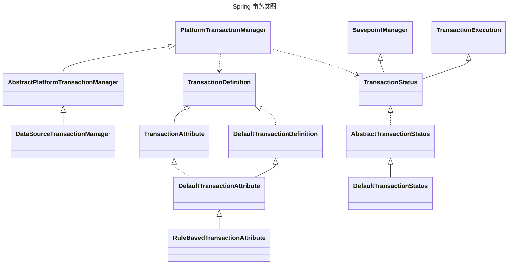
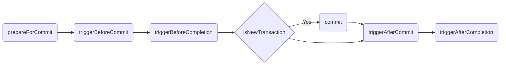
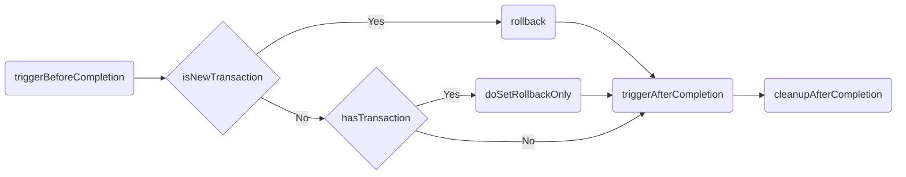
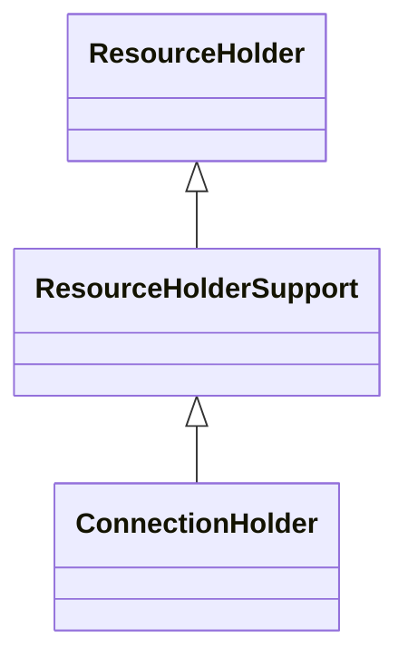

# 理解并完成 Spring 事务传播机制与 EJB 规范的联系

## EJB Translation Attributes

Container-Managed Transaction Demarcation for Business Methods

1. NOT_SUPPORTED
   1. `invoke()`方法之前，需要`suspends`当前事务上下文，并与当前线程关联
   2. `invoke()`发放之后，需要`resumes`保存的事务上下文
   3. 被`suspends`的事务上下文不需要在ResourceManger或者Bean之间传递

    ```mermaid
    ---
    title: NOT_SUPPORTED
    ---
    flowchart LR
        suspends(suspends transaction) -->
        invoke(invoke method) --> 
        resumes(resumes transaction)
    ```

2. REQUIRED
   1. `invoke()`的方法必须存在一个TranslationAttributes为REQUIRED的事务上下文
   2. 如果不存在事务上下文则开始起一个新的TranslationAttributes为REQUIRED的事务上下文
   3. 对于异步方法，行为和REQUIRES_NEW一样
   4. 执行下一个方法时，传递事务上下文
   5. 在方法结果返回之前提交事务

    ```mermaid
    ---
    title: REQUIRED
    ---
    flowchart LR
        new(new transaction) -->
        invoke(invoke method) --pass transaction--> 
        invokeOther(invoke other method) -->
        commit(commit)
    ```

3. SUPPORTS
   1. 对于存在事务上下文的方法，行为和REQUIRED一样
   2. 对于不存在事务上下文的方法，行为和NOT_SUPPORTED一样
   3. 需要确定方法在两种模式下一致性
4. REQUIRES_NEW
   1. 对于存在事务上下文的方法，
      1. `suspends`当前事务上下文，并与当前线程关联
      2. 开启一个新的事务上下文
      3. 执行下一个方法时，传递新的事务上下文，
      4. 方法执行完毕后`resumes`保存的事务上下文
   2. 对于不存在事务上下文的方法
      1. 开启一个新的事务上下文，并传递事务上下文

    ```mermaid
    ---
    title: REQUIRES_NEW
    ---
    flowchart LR
        hasTransaction{has Transaction?} --> |Yes| suspends(suspends transaction) --> new(new transaction) --> invoke(invoke method)  --pass new transaction--> 
        invokeOther(invoke other method)
        --> commit(commit) -->
        resumes(resumes transaction)
        hasTransaction --> |No| new(new transaction)
    ```

5. MANDATORY
   1. 对于存在事务上下文的方法，行为和REQUIRED一样
   2. 对于不存在事务上下文的方法，抛出异常
6. NEVER
   1. 对于存在事务上下文的方法，抛出异常
   2. 对于不存在事务上下文的方法，行为和NOT_SUPPORTED一样

## Spring Implementation



### getTransaction()

```java
TransactionStatus getTransaction(@Nullable TransactionDefinition definition) throws TransactionException;
```

1. `Object transaction = doGetTransaction();` // 获取事务
2. `isExistingTransaction(transaction)` // 判断是否已经存在事务
3. 存在事务
   - NEVER throw IllegalTransactionStateException()
   - NOT_SUPPORTED  
  suspend(transaction) // 挂起当前事务  
  prepareTransactionStatus() // 生成TransactionStatus transaction = null; newTransaction = false;
   - REQUIRES_NEW  
  suspend(transaction) // 挂起当前事务  
  startTransaction() // 开启新事务  
  resumeAfterBeginException() // 开启事务的过程中异常了就resume
   - MANDATORY
   - REQUIRED
   - SUPPORTS  
  prepareTransactionStatus() // 生成TransactionStatus transaction = oldTransaction; newTransaction = false;
4. 不存在事务
   - MANDATORY  throw IllegalTransactionStateException()
   - REQUIRED
   - REQUIRES_NEW  
  suspend(null) // 不挂起任何事务  
  startTransaction() // 开启新事务 生成TransactionStatus transaction = transaction; newTransaction = true;
   - NOT_SUPPORTED
   - SUPPORTS
   - NEVER  
  prepareTransactionStatus() // 生成TransactionStatus transaction = null; newTransaction = true;

### commit()

```java
void commit(TransactionStatus status) throws TransactionException;
```



### rollback()

```java
void rollback(TransactionStatus status) throws TransactionException;
```



## AbstractPlatformTransactionManager 抽象

- `org.springframework.transaction.support.AbstractPlatformTransactionManager#doGetTransaction`
- `org.springframework.transaction.support.AbstractPlatformTransactionManager#isExistingTransaction`
- `org.springframework.transaction.support.AbstractPlatformTransactionManager#doResume`
- `org.springframework.transaction.support.AbstractPlatformTransactionManager#doSuspend`
- `org.springframework.transaction.support.AbstractPlatformTransactionManager#doBegin`
- `org.springframework.transaction.support.AbstractPlatformTransactionManager#doCommit`
- `org.springframework.transaction.support.AbstractPlatformTransactionManager#doRollback`

### DataSourceTransactionManager实现

#### `doGetTransaction()`

```java
protected abstract Object doGetTransaction() throws TransactionException;

@Override
protected Object doGetTransaction() {
    DataSourceTransactionObject txObject = new DataSourceTransactionObject();
    txObject.setSavepointAllowed(isNestedTransactionAllowed());
    ConnectionHolder conHolder = (ConnectionHolder) TransactionSynchronizationManager.getResource(obtainDataSource());
    txObject.setConnectionHolder(conHolder, false);
    return txObject;
}
```

创建一个ConnectionHolder，以DataSource对象为key，ConnectionHolder对象为value绑定到ThreadLocal `Transactional resources`中

##### ConnectionHolder  



##### TransactionSynchronizationManager

```java
private static final ThreadLocal<Map<Object, Object>> resources = new NamedThreadLocal<>("Transactional resources");

private static final ThreadLocal<Set<TransactionSynchronization>> synchronizations = new NamedThreadLocal<>("Transaction synchronizations");

private static final ThreadLocal<String> currentTransactionName = new NamedThreadLocal<>("Current transaction name");

private static final ThreadLocal<Boolean> currentTransactionReadOnly = new NamedThreadLocal<>("Current transaction read-only status");

private static final ThreadLocal<Integer> currentTransactionIsolationLevel = new NamedThreadLocal<>("Current transaction isolation level");

private static final ThreadLocal<Boolean> actualTransactionActive = new NamedThreadLocal<>("Actual transaction active");
```

#### `isExistingTransaction()`

```java
protected boolean isExistingTransaction(Object transaction) throws TransactionException {
    return false;
}

@Override
protected boolean isExistingTransaction(Object transaction) {
    DataSourceTransactionObject txObject = (DataSourceTransactionObject) transaction;
    return (txObject.hasConnectionHolder() && txObject.getConnectionHolder().isTransactionActive());
}
```

是否存在事务判断  
`DataSourceTransactionObject` 是否有ConnectionHolder  
ConnectionHolder是否激活事务

#### `doBegin()`

```java
protected abstract void doBegin(Object transaction, TransactionDefinition definition) throws TransactionException;

@Override
protected void doBegin(Object transaction, TransactionDefinition definition) {
    DataSourceTransactionObject txObject = (DataSourceTransactionObject) transaction;
    Connection con = null;

    try {
        if (!txObject.hasConnectionHolder() ||
                txObject.getConnectionHolder().isSynchronizedWithTransaction()) {
            Connection newCon = obtainDataSource().getConnection();
            if (logger.isDebugEnabled()) {
                logger.debug("Acquired Connection [" + newCon + "] for JDBC transaction");
            }
            txObject.setConnectionHolder(new ConnectionHolder(newCon), true);
        }

        txObject.getConnectionHolder().setSynchronizedWithTransaction(true);
        con = txObject.getConnectionHolder().getConnection();

        Integer previousIsolationLevel = DataSourceUtils.prepareConnectionForTransaction(con, definition);
        txObject.setPreviousIsolationLevel(previousIsolationLevel);
        txObject.setReadOnly(definition.isReadOnly());

        // Switch to manual commit if necessary. This is very expensive in some JDBC drivers,
        // so we don't want to do it unnecessarily (for example if we've explicitly
        // configured the connection pool to set it already).
        if (con.getAutoCommit()) {
            txObject.setMustRestoreAutoCommit(true);
            if (logger.isDebugEnabled()) {
                logger.debug("Switching JDBC Connection [" + con + "] to manual commit");
            }
            con.setAutoCommit(false);
        }

        prepareTransactionalConnection(con, definition);
        txObject.getConnectionHolder().setTransactionActive(true);

        int timeout = determineTimeout(definition);
        if (timeout != TransactionDefinition.TIMEOUT_DEFAULT) {
            txObject.getConnectionHolder().setTimeoutInSeconds(timeout);
        }

        // Bind the connection holder to the thread.
        if (txObject.isNewConnectionHolder()) {
            TransactionSynchronizationManager.bindResource(obtainDataSource(), txObject.getConnectionHolder());
        }
    }

    catch (Throwable ex) {
        if (txObject.isNewConnectionHolder()) {
            DataSourceUtils.releaseConnection(con, obtainDataSource());
            txObject.setConnectionHolder(null, false);
        }
        throw new CannotCreateTransactionException("Could not open JDBC Connection for transaction", ex);
    }
}
```

1. 判断是否存在ConnectionHolder，不存在则创建数据库连接
2. 设置数据库隔离级别etc.  `DataSourceUtils.prepareConnectionForTransaction`
3. 如果`isNewConnectionHolder` 绑定到ThreadLocal `Transactional resources`中

#### `doSuspend()`

```java
protected Object doSuspend(Object transaction) throws TransactionException {
    throw new TransactionSuspensionNotSupportedException("Transaction manager [" + getClass().getName() + "] does not support transaction suspension");
}

@Override
protected Object doSuspend(Object transaction) {
    DataSourceTransactionObject txObject = (DataSourceTransactionObject) transaction;
    txObject.setConnectionHolder(null);
    return TransactionSynchronizationManager.unbindResource(obtainDataSource());
}
```

设置`ConnectionHolder`为null，`unbindResource`，并返回旧的`ConnectionHolder`，保存到`SuspendedResourcesHolder`中  
开一个新的`ConnectionHolder`，旧的存起来

#### `doResume()`

```java
protected void doResume(@Nullable Object transaction, Object suspendedResources) throws TransactionException {
    throw new TransactionSuspensionNotSupportedException("Transaction manager [" + getClass().getName() + "] does not support transaction suspension");
}

@Override
protected void doResume(@Nullable Object transaction, Object suspendedResources) {
    TransactionSynchronizationManager.bindResource(obtainDataSource(), suspendedResources);
}
```

把旧的`ConnectionHolder`从`SuspendedResourcesHolder`中取出来，重新绑定回ThreadLocal`Transactional resources`中

#### `doCommit()`

```java
protected abstract void doCommit(DefaultTransactionStatus status) throws TransactionException;

@Override
protected void doCommit(DefaultTransactionStatus status) {
    DataSourceTransactionObject txObject = (DataSourceTransactionObject) status.getTransaction();
    Connection con = txObject.getConnectionHolder().getConnection();
    if (status.isDebug()) {
        logger.debug("Committing JDBC transaction on Connection [" + con + "]");
    }
    try {
        con.commit();
    }
    catch (SQLException ex) {
        throw translateException("JDBC commit", ex);
    }
}
```

执行`ConnectionHolder` 中的`connection.commit()`

#### `doRollback()`

```java
protected abstract void doRollback(DefaultTransactionStatus status) throws TransactionException;

@Override
protected void doRollback(DefaultTransactionStatus status) {
    DataSourceTransactionObject txObject = (DataSourceTransactionObject) status.getTransaction();
    Connection con = txObject.getConnectionHolder().getConnection();
    if (status.isDebug()) {
        logger.debug("Rolling back JDBC transaction on Connection [" + con + "]");
    }
    try {
        con.rollback();
    }
    catch (SQLException ex) {
        throw translateException("JDBC rollback", ex);
    }
}
```

执行`ConnectionHolder` 中的`connection.rollback()`
