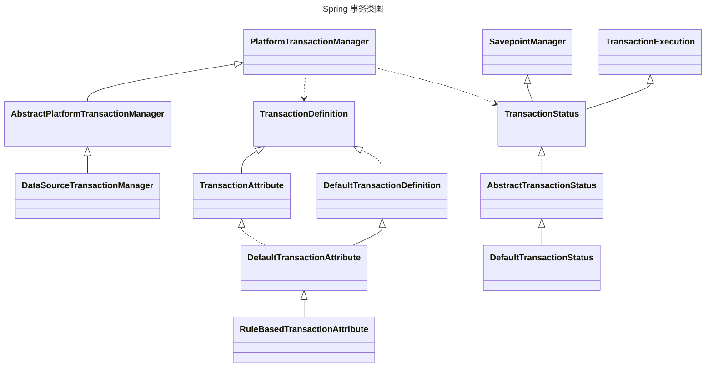
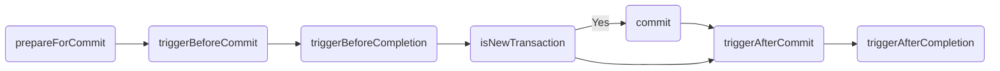
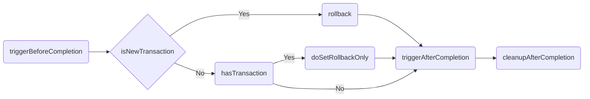

# 理解并完成 Spring 事务传播机制与 EJB 规范的联系

## EJB Translation Attributes

Container-Managed Transaction Demarcation for Business Methods

1. NOT_SUPPORTED
   1. `invoke()`方法之前，需要`suspends`当前事务上下文，并与当前线程关联
   2. `invoke()`发放之后，需要`resumes`保存的事务上下文
   3. 被`suspends`的事务上下文不需要在ResourceManger或者Bean之间传递

    ```mermaid
    ---
    title: NOT_SUPPORTED
    ---
    flowchart LR
        suspends(suspends transaction) -->
        invoke(invoke method) --> 
        resumes(resumes transaction)
    ```

2. REQUIRED
   1. `invoke()`的方法必须存在一个TranslationAttributes为REQUIRED的事务上下文
   2. 如果不存在事务上下文则开始起一个新的TranslationAttributes为REQUIRED的事务上下文
   3. 对于异步方法，行为和REQUIRES_NEW一样
   4. 执行下一个方法时，传递事务上下文
   5. 在方法结果返回之前提交事务

    ```mermaid
    ---
    title: REQUIRED
    ---
    flowchart LR
        new(new transaction) -->
        invoke(invoke method) --pass transaction--> 
        invokeOther(invoke other method) -->
        commit(commit)
    ```

3. SUPPORTS
   1. 对于存在事务上下文的方法，行为和REQUIRED一样
   2. 对于不存在事务上下文的方法，行为和NOT_SUPPORTED一样
   3. 需要确定方法在两种模式下一致性
4. REQUIRES_NEW
   1. 对于存在事务上下文的方法，
      1. `suspends`当前事务上下文，并与当前线程关联
      2. 开启一个新的事务上下文
      3. 执行下一个方法时，传递新的事务上下文，
      4. 方法执行完毕后`resumes`保存的事务上下文
   2. 对于不存在事务上下文的方法
      1. 开启一个新的事务上下文，并传递事务上下文

    ```mermaid
    ---
    title: REQUIRES_NEW
    ---
    flowchart LR
        hasTransaction(has Transaction?) --> |Yes| suspends(suspends transaction) --> new(new transaction) --> invoke(invoke method)  --pass new transaction--> 
        invokeOther(invoke other method)
        --> commit(commit) -->
        resumes(resumes transaction)
        hasTransaction --> |No| new(new transaction)
    ```

5. MANDATORY
   1. 对于存在事务上下文的方法，行为和REQUIRED一样
   2. 对于不存在事务上下文的方法，抛出异常
6. NEVER
   1. 对于存在事务上下文的方法，抛出异常
   2. 对于不存在事务上下文的方法，行为和NOT_SUPPORTED一样

## Spring Implementation



### getTransaction()

```java
TransactionStatus getTransaction(@Nullable TransactionDefinition definition) throws TransactionException;
```

1. `Object transaction = doGetTransaction();` // 获取事务
2. `isExistingTransaction(transaction)` // 判断是否已经存在事务
3. 存在事务
   - NEVER throw IllegalTransactionStateException()
   - NOT_SUPPORTED
  suspend(transaction) // 挂起当前事务
  prepareTransactionStatus()// 生成TransactionStatus transaction = null; newTransaction = false;
   - REQUIRES_NEW
  suspend(transaction) // 挂起当前事务
  startTransaction() // 开启新事务
  resumeAfterBeginException() // 开启事务的过程中异常了就resume
   - MANDATORY
   - REQUIRED
   - SUPPORTS
  prepareTransactionStatus() // 生成TransactionStatus transaction = oldTransaction; newTransaction = false;
4. 不存在事务
   - MANDATORY  throw IllegalTransactionStateException()
   - REQUIRED
   - REQUIRES_NEW
  suspend(null) // 不挂起任何事务
  startTransaction() // 开启新事务 生成TransactionStatus transaction = transaction; newTransaction = true;
   - NOT_SUPPORTED
   - SUPPORTS
   - NEVER
  prepareTransactionStatus() // 生成TransactionStatus transaction = null; newTransaction = true;

## commit()

```java
void commit(TransactionStatus status) throws TransactionException;
```



### rollback()

```java
void rollback(TransactionStatus status) throws TransactionException;
```


